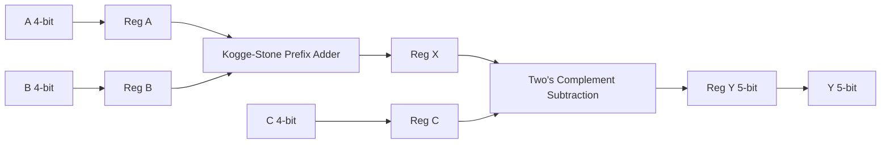
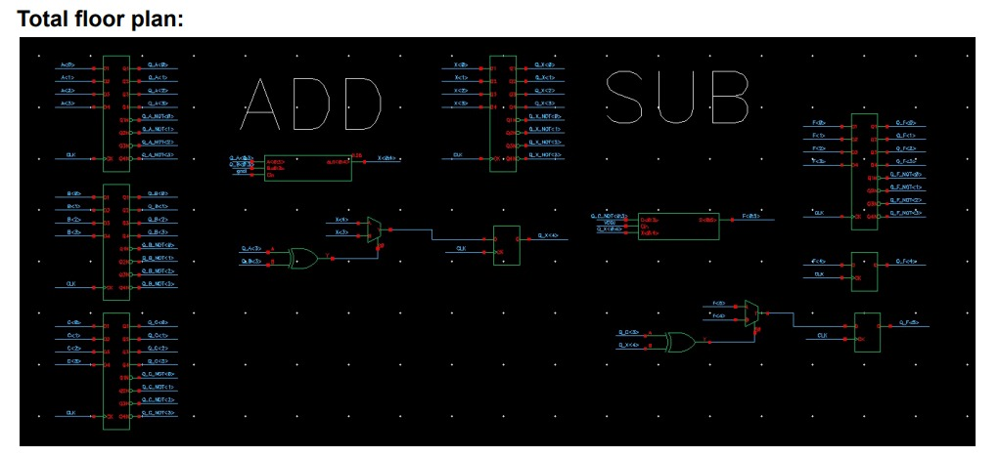
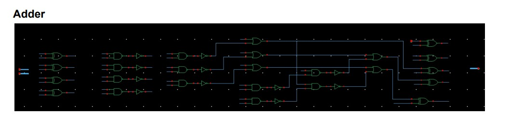
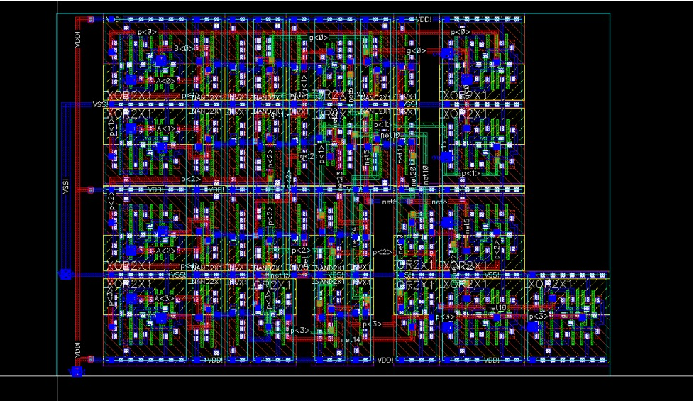
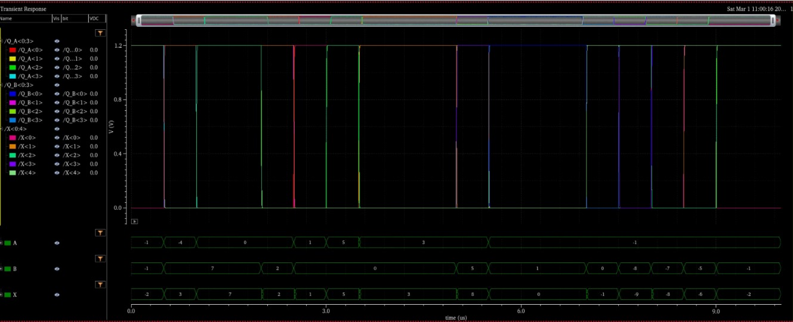
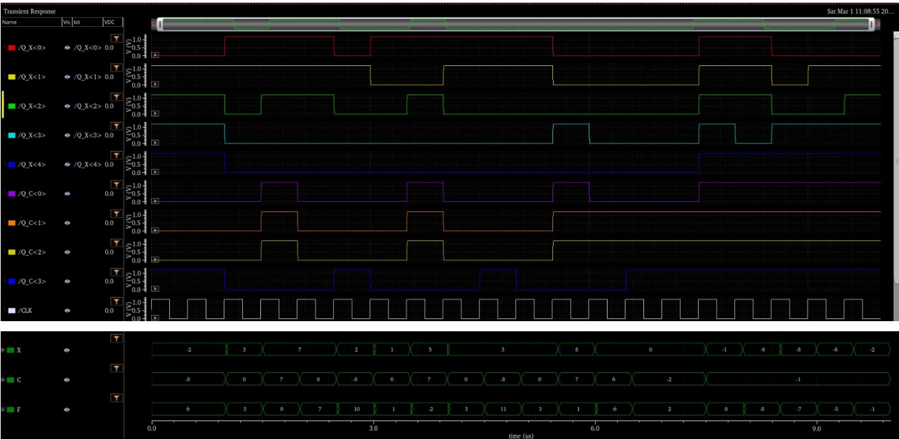
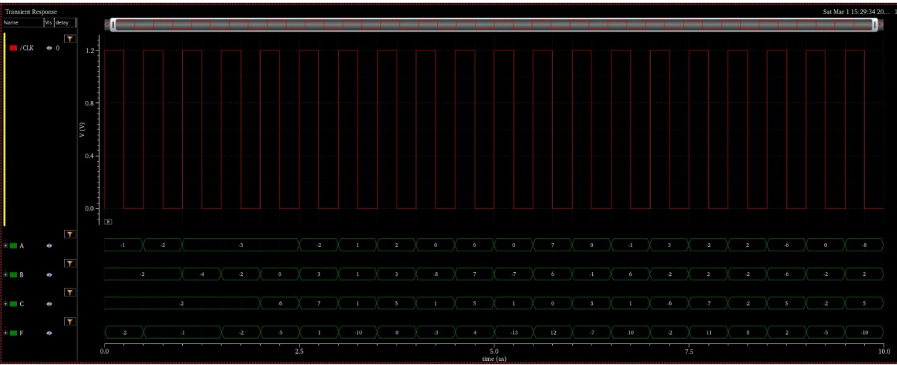
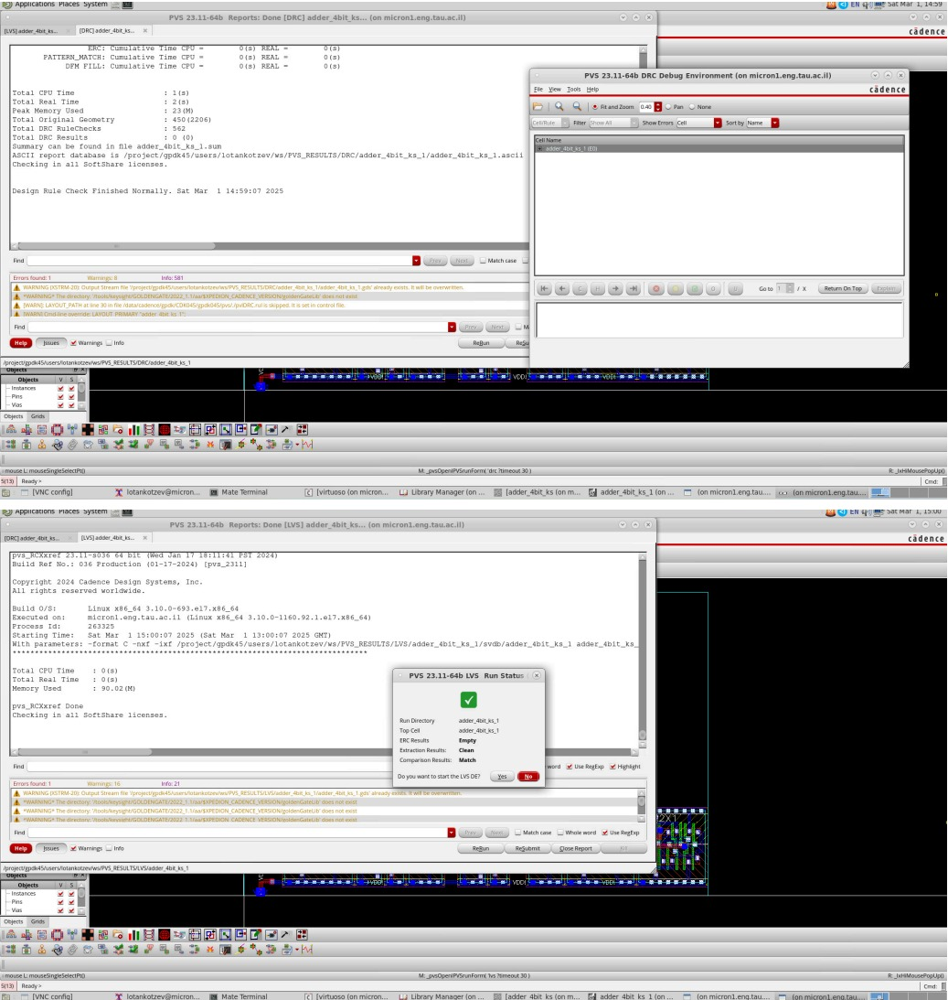

# 4-bit ALU in Cadence Virtuoso (gpdk045)

## Overview

This project implements a synchronous 4-bit ALU using standard cells from **gsclib045** in Cadence Virtuoso.

Operations:
- X = A + B  
- Y = X − C (two’s complement subtraction)

The design includes registered inputs/outputs, a tree-based Kogge-Stone prefix adder, multi-voltage timing characterization (0.9V / 1.2V), and a DRC/LVS-clean physical layout implementation.

---

## Architecture

### System Timing Relationship

The overall timing behavior of the system is:

F[N + 2] = A[N] + B[N] − C[N + 1]

The subtractor stage introduces the longest logic path and therefore determines the maximum operating frequency.

---

## Top-Level Floorplan

Hierarchical separation between ADD and SUB datapaths with structured register placement and controlled signal flow.

---

## Tree-Based Adder Architecture

A Kogge-Stone prefix structure was selected to minimize carry propagation delay through parallel prefix computation.

The adder structure:
- Generates propagate/generate signals
- Computes carries using prefix stages
- Produces final sum via XOR combination

---

## Subtraction Implementation

Subtraction is implemented using two’s complement arithmetic:

Y = X − C  
= X + (~C + 1)

Implementation details:
- Operand C is bitwise inverted
- Carry-in (Cin) is forced to logic '1'
- The same prefix carry structure is reused

This avoids duplicating arithmetic hardware and preserves identical carry propagation depth for addition and subtraction.

Overflow handling is implemented by detecting operand sign similarity and selecting between carry-out and MSB extension using XOR-based control logic.

---

## Physical Design

Design characteristics:

- Standard-cell row-based placement
- Identical cells vertically stacked (flipped for VDD/VSS alignment)
- Global VDD/VSS rails aligned across rows
- Metal2 and Metal3 used for efficient routing
- Each logic path confined within a single row to maintain structured timing behavior

---

## Verification

### Functional Verification

Bus-based waveform validation confirms:
- Correct ADD operation
- Correct SUB operation
- Proper multi-cycle timing alignment

### DRC / LVS

Adder layout is:
- DRC-clean
- LVS-matched to schematic

---

## Timing Characterization

The critical path was identified from **C0 → F5** (subtractor stage).

### Measured Logic Delay (T_logic)

| Voltage | Rising (ps) | Falling (ps) |
|----------|--------------|--------------|
| 1.2V     | 220          | 220          |
| 0.9V     | 440          | 450          |

As expected, reduced supply voltage increases propagation delay due to lower drive strength.

---

## Flip-Flop Characterization

| Parameter | 1.2V | 0.9V |
|------------|--------|--------|
| TCQ        | 57–70 ps | 114–150 ps |
| Tsetup     | 11.66 ps | 30 ps |
| Thold      | 10.89 ps | 17.67 ps |

Setup and hold times were extracted using controlled input delay sweeps relative to the clock edge.

---

## Maximum Clock Frequency

Using:

Tclk > TCQ + Tlogic + Tsetup

Final Results:

| Voltage | Minimum Tclk | Fmax |
|----------|--------------|--------|
| 1.2V     | > 302 ps     | < 3.31 GHz |
| 0.9V     | > 430 ps     | < 2.32 GHz |

Higher supply voltage enables higher maximum clock frequency due to reduced logic and flip-flop delays.

---

## Area Analysis

Estimated adder cell area: **64.068 µm²**  
Measured layout area: **81.21 µm²**

Area < 150% of estimated constraint ✔

Additional area overhead results from:
- Power routing (VDD/VSS distribution)
- Vertical stacking constraints
- Cell size differences
- Routing alignment gaps

---

## Skills Demonstrated

- Kogge-Stone prefix adder design
- Two’s complement subtraction reuse strategy
- Critical path isolation methodology
- Multi-voltage timing characterization
- Flip-flop setup/hold extraction
- Frequency derivation from physical delay
- Structured standard-cell physical layout
- Metal-layer routing optimization
- DRC & LVS verification
- Area constraint validation
- Hierarchical synchronous design methodology
=======
- Tree-based prefix adder implementation
- Synchronous digital design
- Critical path identification
- Multi-voltage timing analysis
- Standard-cell physical layout
- Row-based placement strategy
- DRC and LVS verification
- Hierarchical design methodology
>>>>>>> 
