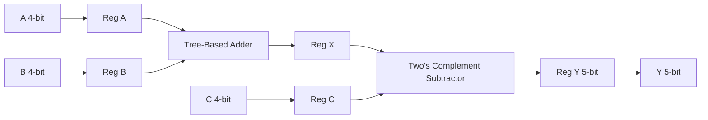

# 4-bit ALU in Cadence Virtuoso (gpdk045)

## Overview

This project implements a synchronous 4-bit ALU using standard cells from gsclib045 in Cadence Virtuoso.

Operations:
- X = A + B
- Y = X − C (two’s complement subtraction)

The design includes input/output registers, tree-based prefix adder architecture, timing characterization at 0.9V and 1.2V, and a DRC/LVS-clean physical layout.

---

## Architecture

---

## Top-Level Floorplan

Hierarchical organization separating ADD and SUB datapaths with structured register placement.

---

## Tree-Based Adder Architecture

Prefix carry propagation structure selected according to project requirements.

---

## Subtraction Implementation

Subtraction implemented using two’s complement:

Y = X − C  
= X + (~C + 1)

The subtractor reuses the same prefix carry structure by:
- Inverting operand C
- Forcing carry-in to logic ‘1’

This avoids duplication of arithmetic logic and preserves timing consistency.

---

## Physical Design

Standard-cell row-based placement with structured routing and global power rails.

---

## Verification

### Functional Verification

Bus-based waveform validation for ADD and SUB operations.

### DRC / LVS

Adder layout is DRC-clean and LVS-matched against schematic.

---

## Timing Characterization

Characterized at:

- VDD = 1.2V
- VDD = 0.9V

Measured:
- Critical path delay
- Setup / Hold constraints
- Maximum clock frequency (Fmax)

| Voltage | Critical Path (ns) | Fmax (GHz) |
|----------|--------------------|------------|
| 1.2V     | TBD                | TBD        |
| 0.9V     | TBD                | TBD        |

---

## Skills Demonstrated

- Tree-based prefix adder implementation
- Synchronous digital design
- Critical path identification
- Multi-voltage timing analysis
- Standard-cell physical layout
- Row-based placement strategy
- DRC and LVS verification
- Hierarchical design methodology