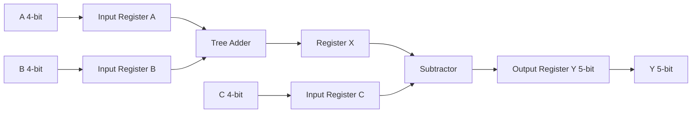

# 4-bit ALU in Cadence Virtuoso (gpdk045)

## Overview

This project implements a synchronous 4-bit ALU using standard cells from gsclib045 in Cadence Virtuoso.

The ALU performs:

- X = A + B
- Y = X − C (two’s complement subtraction)

The design includes input/output registers, tree-based adder architecture, timing characterization at 0.9V and 1.2V, and a DRC/LVS-clean layout for the adder.

---

## Architecture

---

## Design Flow

1. Architecture selection (tree-based prefix adder)
2. Schematic implementation using gsclib045 cells
3. Functional verification (ADD and SUB)
4. Critical path identification
5. Timing characterization @ 0.9V and 1.2V
6. Adder layout implementation
7. DRC and LVS verification

---

## Subtraction Implementation

Subtraction was implemented using two’s complement arithmetic:

Y = X - C  
= X + (~C + 1)

The subtractor reuses the tree-based adder architecture by:

- Inverting operand C
- Forcing the carry-in to logic ‘1’
- Preserving the same prefix carry propagation structure

This approach avoids duplicating arithmetic logic and maintains consistent critical path behavior between addition and subtraction.

Timing analysis confirmed that subtraction shares the same worst-case carry propagation path as addition.

## Timing Characterization

The design was characterized at:

- VDD = 1.2V
- VDD = 0.9V

Measured:

- Critical path delay
- Setup / Hold constraints
- Maximum clock frequency (Fmax)

(Detailed results in /results)

---

## Layout

Adder layout implemented with:

- Row-based standard cell placement
- Clean DRC
- Clean LVS
- Area constraint satisfied

(Layout screenshots in /figures)

---

## Skills Demonstrated

- Digital synchronous design
- Tree-based prefix adder implementation
- Timing analysis and Fmax derivation
- Multi-voltage characterization
- Physical design (placement & routing)
- DRC/LVS verification
- Hierarchical schematic methodology
